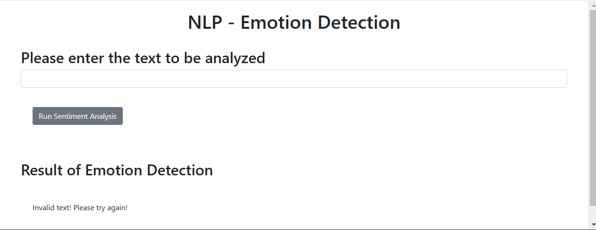

# AI Emotion Detection Application

This repository contains the implementation of an AI-based Emotion Detection Application, developed using Python and Flask. The project demonstrates the practical application of AI technologies, web development, and deployment, focusing on analyzing customer feedback to detect emotions like joy, sadness, anger, and more. This system provides deeper insights beyond basic sentiment analysis and can be utilized in recommendation systems, chatbots, and other AI-driven solutions.

## Table of Contents
- [Overview](#overview)
- [Features](#features)
- [Technologies Used](#technologies-used)
- [Tasks and Implementation](#tasks-and-implementation)
  - [Task 1: Fork and Clone the Project Repository](#task-1-fork-and-clone-the-project-repository)
  - [Task 2: Create the Emotion Detection Application](#task-2-create-the-emotion-detection-application)
  - [Task 3: Format the Application Output](#task-3-format-the-application-output)
  - [Task 4: Package the Application](#task-4-package-the-application)
  - [Task 5: Run Unit Tests](#task-5-run-unit-tests)
  - [Task 6: Deploy the Application Using Flask](#task-6-deploy-the-application-using-flask)
  - [Task 7: Incorporate Error Handling](#task-7-incorporate-error-handling)
  - [Task 8: Run Static Code Analysis](#task-8-run-static-code-analysis)
- [Course Certificate](#course-certificate)
  
## Overview
The AI Emotion Detection Application processes customer feedback provided in text format and identifies the associated emotions. Using Watson NLP libraries, the application extracts emotions like joy, sadness, and anger, providing businesses with actionable insights into customer sentiments.

## Features
1. Emotion detection using Watson NLP libraries.
2. User-friendly web interface powered by Flask.
3. Formatted output for better readability.
4. Robust error handling to manage unexpected inputs and failures.
5. Unit testing to ensure application reliability.
6. Static code analysis for adherence to coding standards.

## Technologies Used
- **Python**: Core programming language for AI and backend development.
- **Flask**: Web framework for deployment.
- **Watson NLP Library**: For emotion detection.
- **Pytest**: For unit testing.
- **Static Code Analysis Tools**: For code quality assurance.

## Tasks and Implementation

### Task 1: Fork and Clone the Project Repository
Cloned the project repository to local machine for further development.

### Task 2: Create the Emotion Detection Application
Implemented emotion detection functionality using Watson NLP libraries. The application processes text feedback and identifies emotions.

### Task 3: Format the Application Output
Enhanced the output format to improve readability and usability of results.

### Task 4: Package the Application
Packaged the application for easy distribution and deployment.

### Task 5: Run Unit Tests
Developed and executed unit tests to ensure the reliability and correctness of the application.

### Task 6: Deploy the Application Using Flask
Deployed the emotion detection application as a web app using Flask, enabling users to interact with it through a browser interface.

### Task 7: Incorporate Error Handling
Added error handling to manage invalid inputs, server errors, and other edge cases gracefully.

### Task 8: Run Static Code Analysis
Performed static code analysis to ensure adherence to coding standards and identify potential issues.

## Course Certificate
You can view the course certificate [here](https://github.com/).
